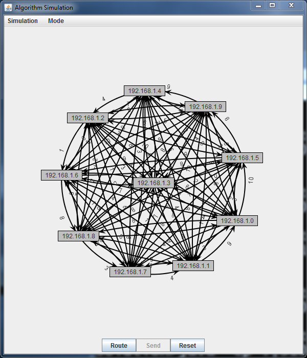
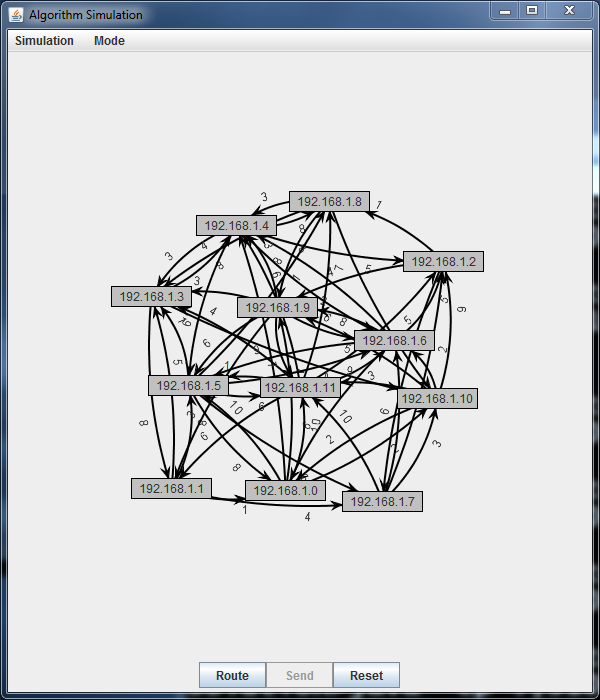
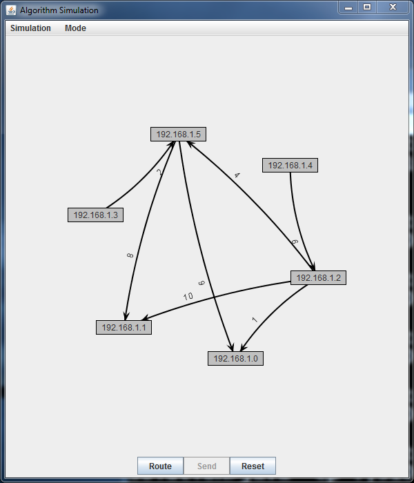
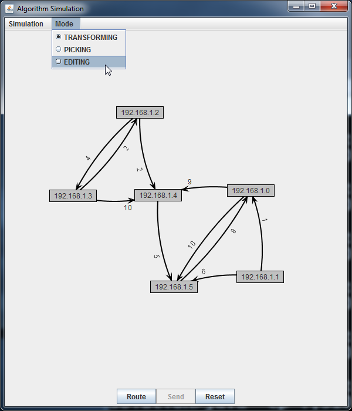
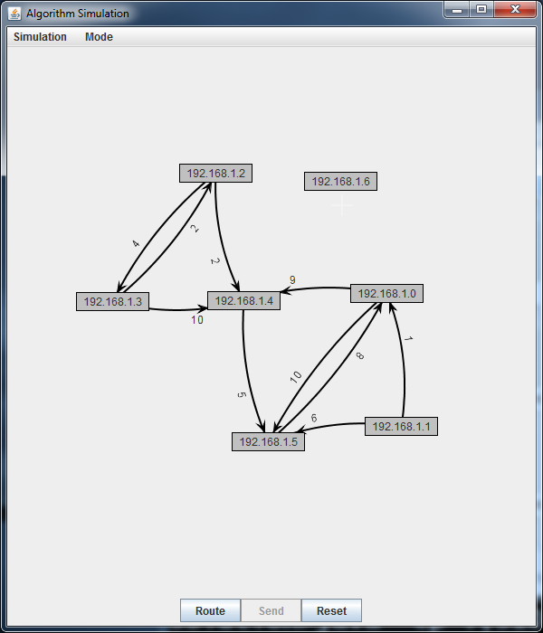
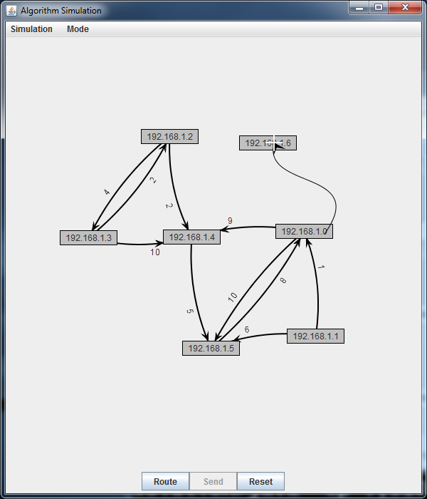
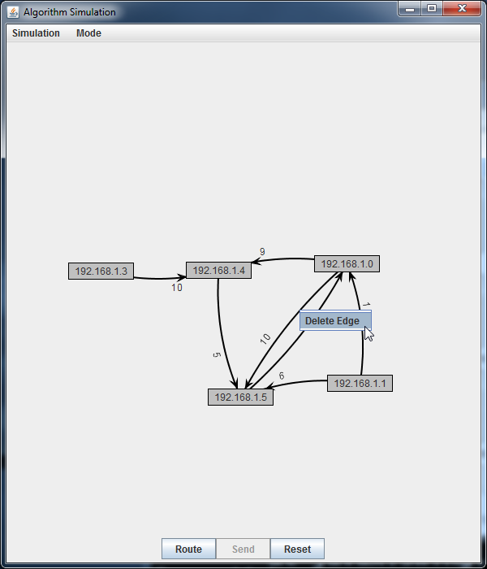
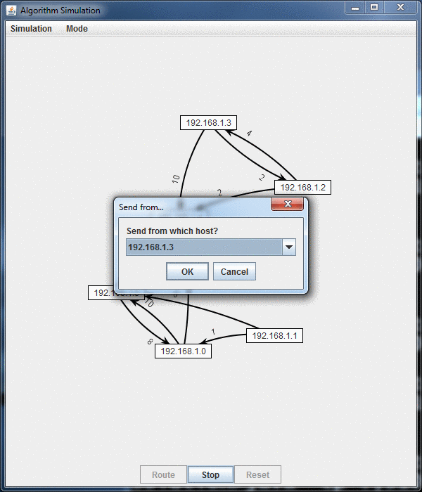
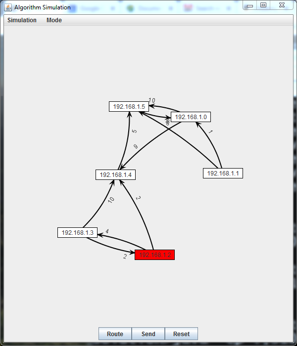

## Examples
[back](README.md)

Example runs of the simulator are given below:
1. [Displaying a graph](#example-1)
2. [Adding nodes and edges to a graph](#example-2)
3. [Removing a nodes and edges from a graph](#example-3)
4. [Running the simulation](#example-4)
5. [Unreachable paths](#example-5)

### Example 1
Displaying a Graph

Once you have the Network class working, you can run the main program to test and debug. The main program is `SimGUI`, which can be compiled and run with the following commands if you are on Windows:

```
javac -cp .;310libs.jar *.java
java -cp .;310libs.jar SimGUI
```

or the following commands if you are on Linux/MacOS:

```
javac -cp .:310libs.jar *.java
java -cp .:310libs.jar SimGUI
```

Why is there extra stuff? The `-cp` is short for `-classpath` (meaning "where the class files can be found). The `.;310libs.jar` or `.:310libs.jar` has the following components: `.` the current directory, `;` or `:` the separator for Windows or Linux/MacOS respectively, `310libs.jar` the provided jar file which contains the library code for JUNG.

If you run the simulator with the above command, you will get a six node graph with some random edges. Each time you hit "reset" you get another graph, but the same sequence of graphs is always generated (for your testing). However, the simulator can also be run with some additional optional parameters to get some more interesting results: The number of nodes, the likelihood that two nodes have an edge between them, the random seed for the graph generator. For example:

Image &nbsp; &nbsp; &nbsp; &nbsp; &nbsp; &nbsp; &nbsp; &nbsp; &nbsp; &nbsp; &nbsp; &nbsp; &nbsp; &nbsp; &nbsp;&nbsp; &nbsp; &nbsp; &nbsp; &nbsp; &nbsp;|Command|Explanation
:---: | :---: | :---:
|`java -cp .;310libs.jar SimGUI`|Generate a six node<br />graph, with connection<br />probability of<br />0.4, and seed 0.
|`java -cp .;310libs.jar SimGUI 10 1`|Generate a ten node<br />graph where all<br />nodes are connected.
|`java -cp .;310libs.jar SimGUI 12 0.5`|Generate a twelve node<br />graph where nodes<br />have a 50% chance<br />of being connected.
|`java -cp .;310libs.jar SimGUI 6 0.4 1123`|Generate a different<br />sequence of graphs<br />using seed 1123.

### Example 2
Adding nodes and edges to a graph

You'll want to test out adding multiple nodes and edges from your graphs to make sure you've gotten out all the bugs.

Image|Explanation
:---: | :---:
|Select "Mode", then "Editing".
|Click Anywhere on the graph surface to add a node.
|Drag to another node to add an edge with a random weight.

### Example 3
Removing a nodes and edges from a graph

You'll want to test out removing multiple nodes and edges from your graphs to make sure you've gotten out all the bugs.

Image|Explanation
:---: | :---:
|In any mode, right click a node and select "delete vertex".
|In any mode, right click an edge and select "delete edge".

Image|Explanation
:---: | :---:

### Example 4
Running the network simulation

Once you complete the project, you can try running the simulation and make sure the network works as intended.

Image|Explanation
:---: | :---:
|Setup your graph (you can zoom<br />with mouse scroll)
|Hit "Route" (nodes should now be white<br />and if you hover over them you'll<br />see their routing tables)
|Hit "Send" (you'll be asked to pick a<br />sending node and a destination,<br />then you'll see the message routed<br />around the network)

### Example 5
What happens for unreachable paths?

The simulator should play through trying to send a message, but then the sending node should turn red because there is no path available.

Image|Explanation
:---: | :---:
|Completed run for a graph with unreachable nodes.